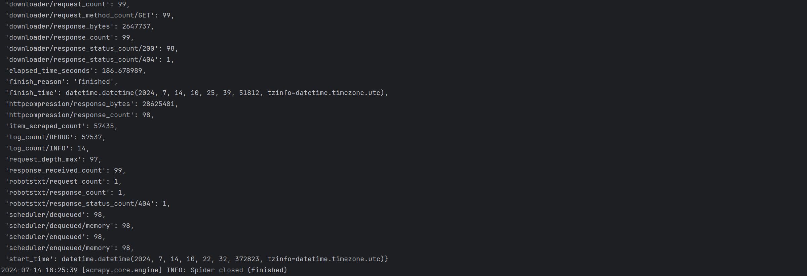
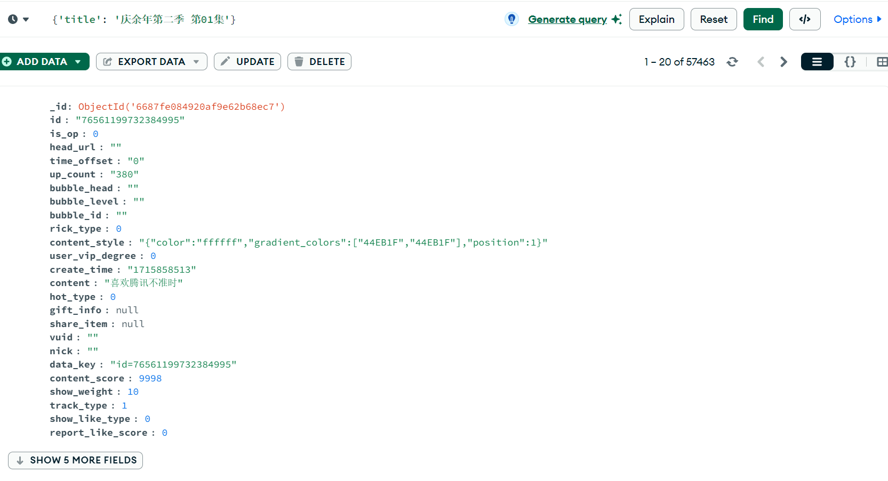
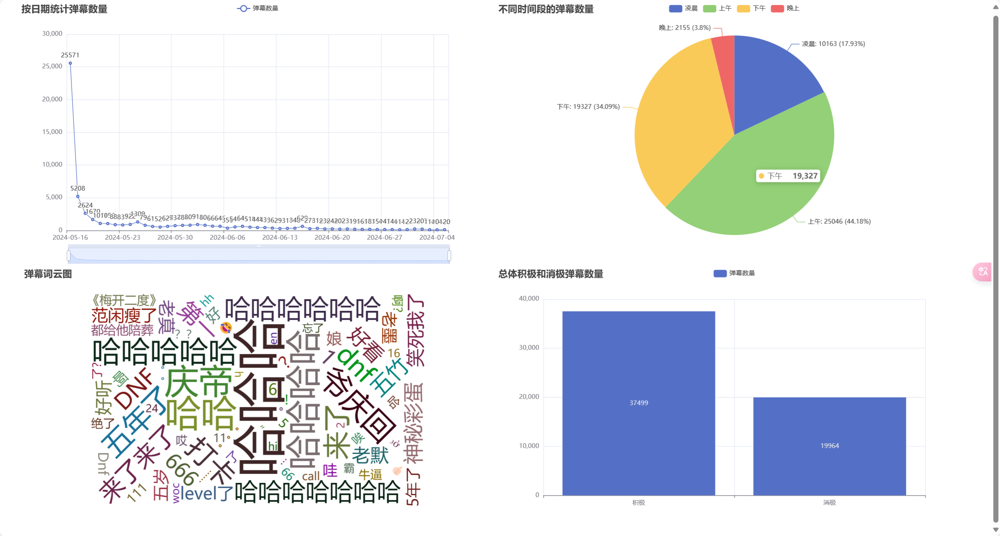

### 一、项目简介

本项目旨在创建一个基于Scrapy框架的弹幕爬虫，从腾讯视频抓取弹幕数据并存储到MongoDB数据库中。随后，对抓取的数据进行情感分析和可视化展示。主要实现的功能包括弹幕数据的爬取、情感分析、数据存储以及数据的可视化展示。

### 二、项目架构

#### 运行环境
- 硬件系统：普通PC或服务器
- 操作系统：Windows 10
- 编程语言：Python 3.8
- 框架：Scrapy 2.4
- 数据库：MongoDB 4.4
- 第三方库：Scrapy, Pymongo, SnowNLP

#### 功能结构图

```
1. 数据爬取
   - 利用Scrapy框架进行弹幕数据的爬取
   - 对爬取的弹幕数据进行情感分析

2. 数据存储
   - 使用MongoDB数据库存储爬取到的弹幕数据

3. 数据分析与可视化
   - 对存储的数据进行分析和可视化展示
```

#### 系统架构图

```
|----- 爬虫模块 (Scrapy) -----|
|                             |
|  腾讯视频 -> 数据抓取 -> MongoDB  |
|                             |
|----- 数据分析与可视化 -----|
```

#### 数据库设计

| 字段名          | 类型    | 描述                 |
|-----------------|---------|----------------------|
| _id             | ObjectId | 数据库自动生成的ID  |
| id              | String  | 弹幕ID               |
| is_op           | Integer | 是否是OP            |
| head_url        | String  | 用户头像URL         |
| time_offset     | String  | 弹幕出现时间         |
| up_count        | String  | 点赞数               |
| bubble_head     | String  | 气泡头               |
| bubble_level    | String  | 气泡等级             |
| bubble_id       | String  | 气泡ID               |
| rick_type       | Integer | 弹幕类型             |
| content_style   | String  | 弹幕内容样式         |
| user_vip_degree | Integer | 用户VIP等级          |
| create_time     | String  | 弹幕创建时间         |
| content         | String  | 弹幕内容             |
| hot_type        | Integer | 热度类型             |
| gift_info       | String  | 礼物信息             |
| share_item      | String  | 分享项               |
| vuid            | String  | 用户ID               |
| nick            | String  | 用户昵称             |
| data_key        | String  | 数据关键字           |
| content_score   | Integer | 内容评分             |
| show_weight     | Integer | 展示权重             |
| track_type      | Integer | 跟踪类型             |
| show_like_type  | Integer | 展示点赞类型         |
| report_like_score| Integer| 举报点赞分数         |
| relate_sku_info | Array   | 相关商品信息         |
| title           | String  | 视频标题             |
| url             | String  | 视频URL              |
| index           | String  | 视频集数             |
| sentiment       | Float   | 弹幕情感分数         |

### 三、项目核心代码说明

#### 爬虫代码

`spiders/danmu_spider.py`

```python
import scrapy
from scrapy import Request
from pymongo import MongoClient
from snownlp import SnowNLP

from danmu_scraper.items import DanmuItem


class DanmuSpider(scrapy.Spider):
    name = 'danmu_spider'
    allowed_domains = ['dm.video.qq.com']

    @classmethod
    def from_crawler(cls, crawler, *args, **kwargs):
        spider = super(DanmuSpider, cls).from_crawler(crawler, *args, **kwargs)
        spider.crawler = crawler
        return spider

    def __init__(self, *args, **kwargs):
        super().__init__(*args, **kwargs)
        self.client = None
        self.db = None
        self.collection = None
        self.headers = {
            'authority': 'dm.video.qq.com',
            'accept': 'application/json, text/plain, */*',
            'accept-language': 'zh-CN,zh;q=0.9,en;q=0.8,en-GB;q=0.7,en-US;q=0.6,ja;q=0.5',
            'origin': 'https://v.qq.com',
            'referer': 'https://v.qq.com/',
            'sec-ch-ua': '"Chromium";v="122", "Not(A:Brand";v="24", "Microsoft Edge";v="122"',
            'sec-ch-ua-mobile': '?0',
            'sec-ch-ua-platform': '"Windows"',
            'sec-fetch-dest': 'empty',
            'sec-fetch-mode': 'cors',
            'sec-fetch-site': 'same-site',
            'user-agent': 'Mozilla/5.0 (Windows NT 10.0; Win64; x64) AppleWebKit/537.36 (KHTML, like Gecko) Chrome/122.0.0.0 Safari/537.36 Edg/122.0.0.0',
        }

    def start_requests(self):
        mongo_uri = self.crawler.settings.get('MONGO_URI')
        mongo_db = self.crawler.settings.get('MONGO_DATABASE')
        self.client = MongoClient(mongo_uri)
        self.db = self.client[mongo_db]
        self.collection = self.db['danmu']

        item_data = [
            {
                "item_id": "q4100dpkd26",
                "item_params": {
                    "play_title": "庆余年第二季 第01集",
                    "title": "1",
                },
            }
        ]
        for item in item_data:
            url = f'https://dm.video.qq.com/barrage/segment/{item["item_id"]}/t/v1/0/30000'
            yield Request(url, self.parse, headers=self.headers,
                          meta={'title': item['item_params']['play_title'], 'url': item['item_id'],
                                'index': item['item_params']['title'], 'start': 0})

    def parse(self, response):
        res = response.json()
        title = response.meta['title']
        url = response.meta['url']
        index = response.meta['index']
        start = response.meta['start']

        if 'barrage_list' in res and res['barrage_list']:
            for barrage in res['barrage_list']:
                item = DanmuItem()
                item['id'] = barrage['id']
                item['is_op'] = barrage.get('is_op', 0)
                item['head_url'] = barrage.get('head_url', '')
                item['time_offset'] = barrage.get('time_offset', '0')
                item['up_count'] = barrage.get('up_count', '0')
                item['bubble_head'] = barrage.get('bubble_head', '')
                item['bubble_level'] = barrage.get('bubble_level', '')
                item['bubble_id'] = barrage.get('bubble_id', '')
                item['rick_type'] = barrage.get('rick_type', 0)
                item['content_style'] = barrage.get('content_style', '{}')
                item['user_vip_degree'] = barrage.get('user_vip_degree', 0)
                item['create_time'] = barrage.get('create_time', '0')
                item['content'] = barrage.get('content', '')
                item['hot_type'] = barrage.get('hot_type', 0)
                item['gift_info'] = barrage.get('gift_info', None)
                item['share_item'] = barrage.get('share_item', None)
                item['vuid'] = barrage.get('vuid', '')
                item['nick'] = barrage.get('nick', '')
                item['data_key'] = barrage.get('data_key', '')
                item['content_score'] = barrage.get('content_score', 0)
                item['show_weight'] = barrage.get('show_weight', 0)
                item['track_type'] = barrage.get('track_type', 0)
                item['show_like_type'] = barrage.get('show_like_type', 0)
                item['report_like_score'] = barrage.get('report_like_score', 0)
                item['relate_sku_info'] = barrage.get('relate_sku_info', [])
                item['title'] = title
                item['url'] = url
                item['index'] = index
                item['sentiment'] = SnowNLP(barrage['content']).sentiments if 'content' in barrage else None
                yield item

            next_start = start + 30000
            next_url = f'https://dm.video.qq.com/barrage/segment/{url}/t/v1/{next_start}/{next_start + 30000}'
            yield Request(next_url, self.parse, headers=self.headers,
                          meta={'title': title, 'url': url, 'index': index, 'start': next_start})
        else:
            self.logger.info(f'{start}, 爬完了')

    def close(self, reason):
        if self.client:
            self.client.close()
```

#### 数据存储代码

`pipelines.py`

```python
from pymongo import MongoClient

class MongoPipeline:
    def __init__(self, mongo_uri, mongo_db):
        self.mongo_uri = mongo_uri
        self.mongo_db = mongo_db

    @classmethod
    def from_crawler(cls, crawler):
        return cls(
            mongo_uri=crawler.settings.get('MONGO_URI'),
            mongo_db=crawler.settings.get('MONGO_DATABASE')
        )

    def open_spider(self, spider):
        self.client = MongoClient(self.mongo_uri)
        self.db = self.client[self.mongo_db]

    def close_spider(self, spider):
        self.client.close()

    def process_item(self, item, spider):
        self.db[spider.name].update_one({'id': item['id']}, {'$set': dict(item)}, upsert=True)
        return item
```

#### 爬虫设置

`settings.py`

```python
MONGO_URI = 'mongodb://localhost:27017/'
MONGO_DATABASE = 'tx_videos'
```

### 四、项目运行截图

#### 爬虫结果截图


#### 持久化存储结果截图


#### 可视化分析图形截图


### 五、总结

本项目通过Scrapy爬虫框架成功实现了对腾讯视频弹幕数据的抓取，并将数据存储到MongoDB数据库中。同时，利用SnowNLP进行了情感分析，初步实现了数据的可视化展示。

#### 现存问题
- 弹幕数据的抓取速度较慢，可以考虑增加并发数和优化请求策略。
- 弹幕数据的情感分析结果还需要进一步验证其准确性。

#### 后续方案
- 优化爬虫抓取速度，增加数据处理效率。
- 完善情感分析算法，提升分析准确性。
- 增加更多的视频数据样本，扩展分析维度。

### 六、参考资料

- [Scrapy官方文档](https://docs.scrapy.org/en/latest/)
- [MongoDB官方文档](https://docs.mongodb.com/)
- [SnowNLP官方文档](https://github.com/isnowfy/snownlp)
- [Python开发者社区](https://www.python.org/community/)